# bims-backend
bims-backend

To Setup You Need to install these softwares:
1. Oracle VirtualBox: https://www.virtualbox.org/
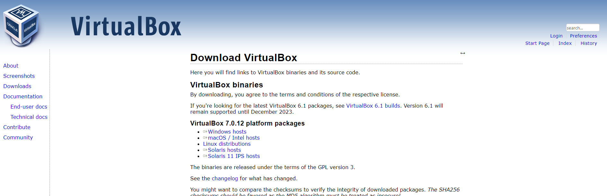
2. Debian OS: https://www.debian.org/download
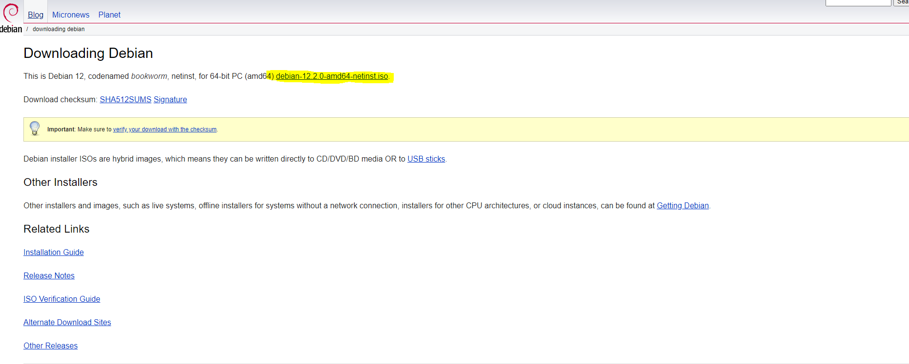
3. Putty: https://www.putty.org/
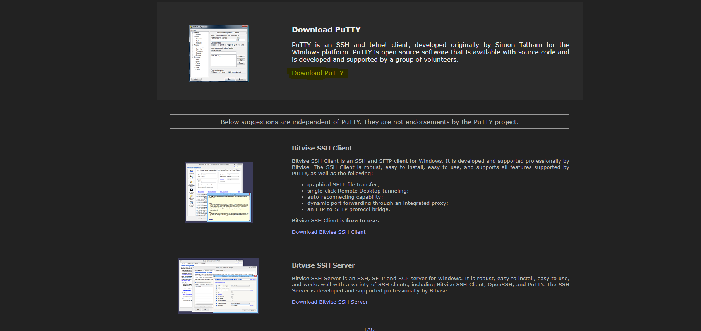
4. Open Oracle VirtualBox and Create new Machine
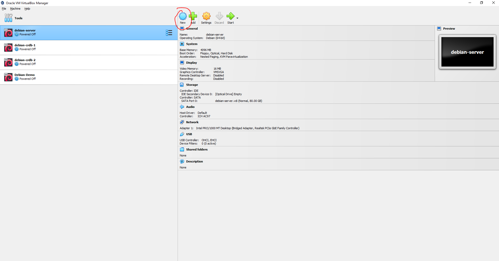
5. Enter the name of the machine and import the debian ISO image
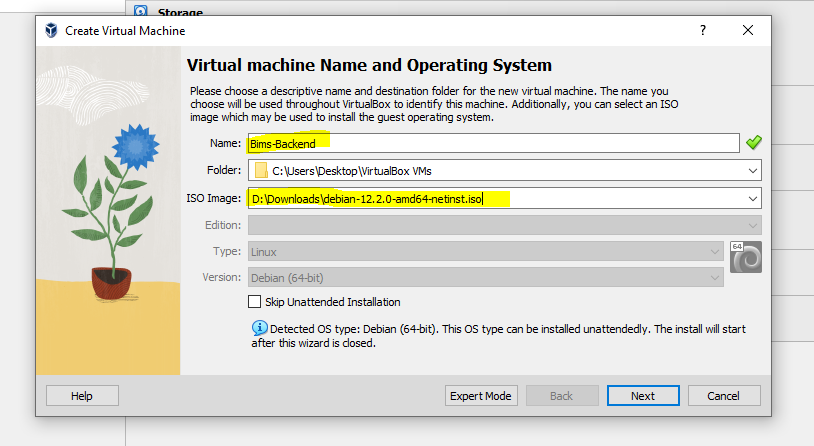
6. Enter the Username you want and the password you want that will be used to log-in into the machine
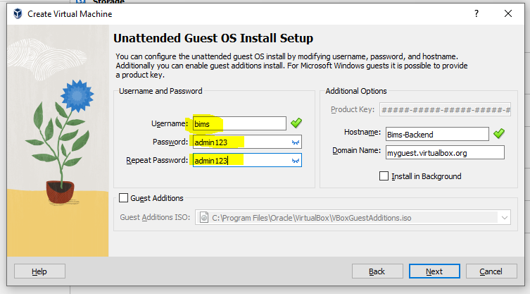
7. Adjust the hardware settings
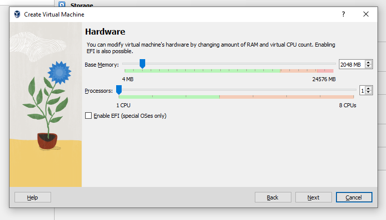
8. Adjust the Hard drive settings
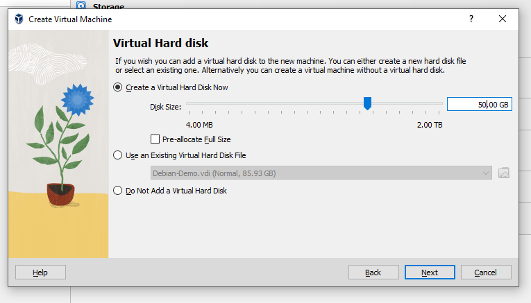
9. Finish the Setup
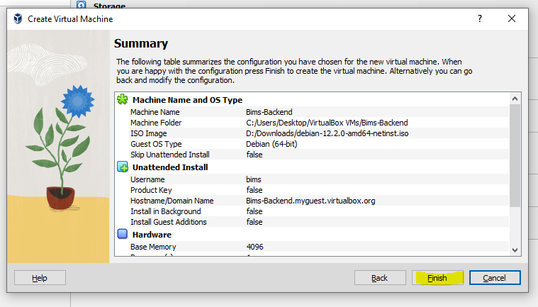
10. Now the Machine will start and do the installation
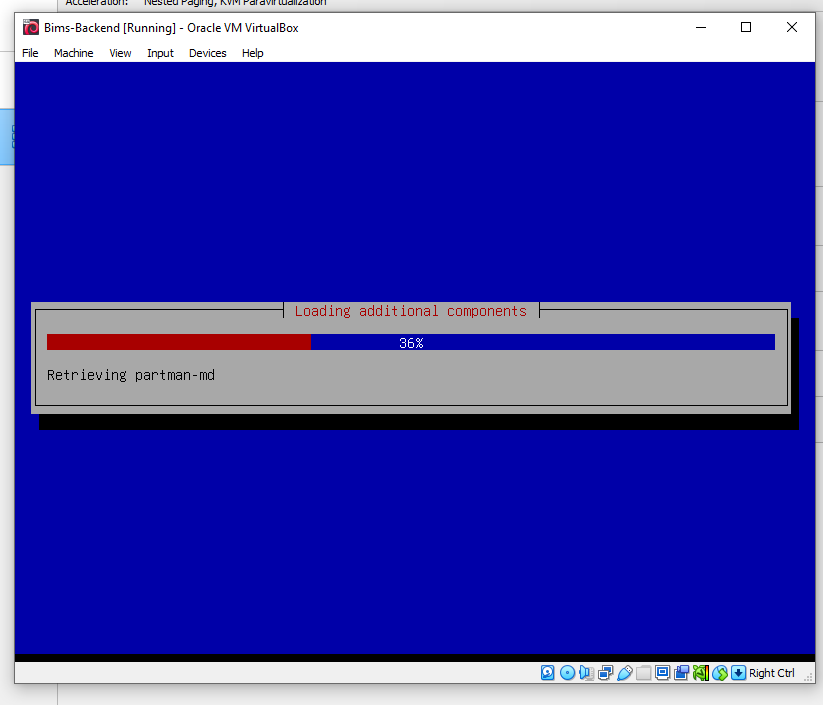
11. Now Click the Machine and click settings
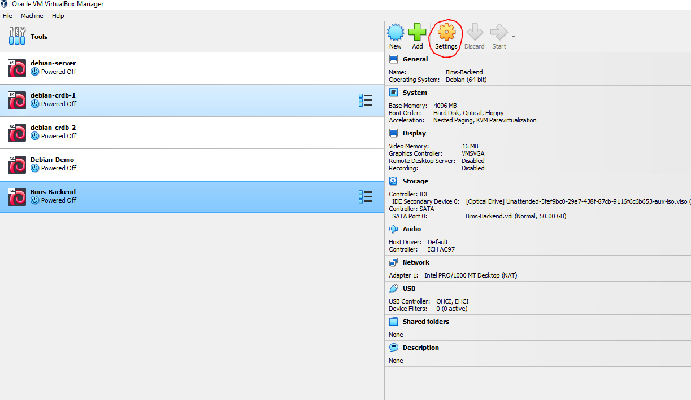
12. Now go to the Network tab and change the Attached to: into "Bridge Adapter" and then Select the appropriate NIC card of the PC in able for the machine to be connected in the network.
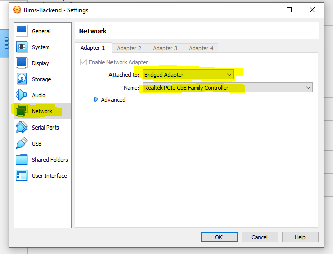
13. After the installation The Machine will start automatically.
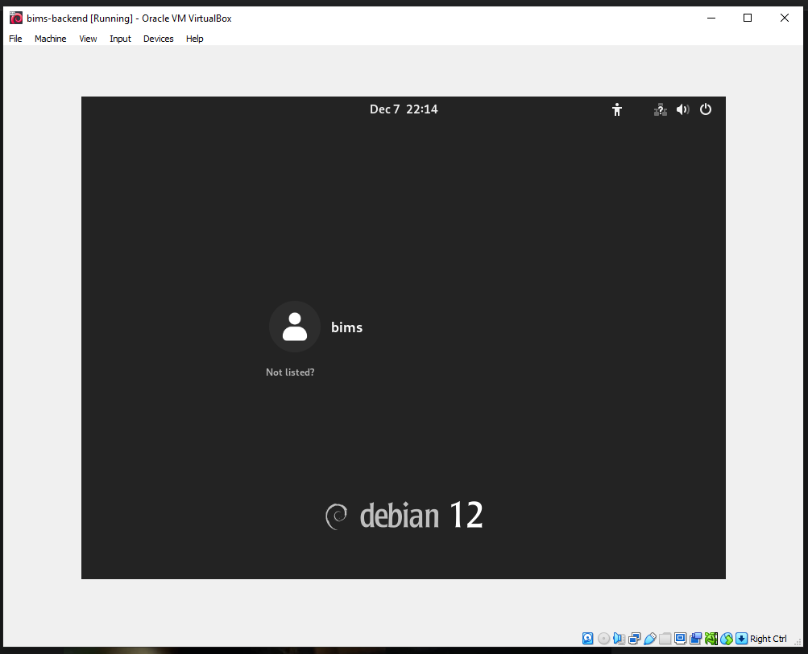
14. Now login as user with the password we set in the user creation of virtualbox
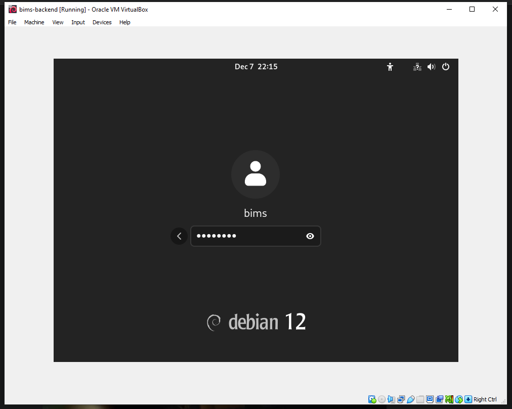
15. You can see the login Successful
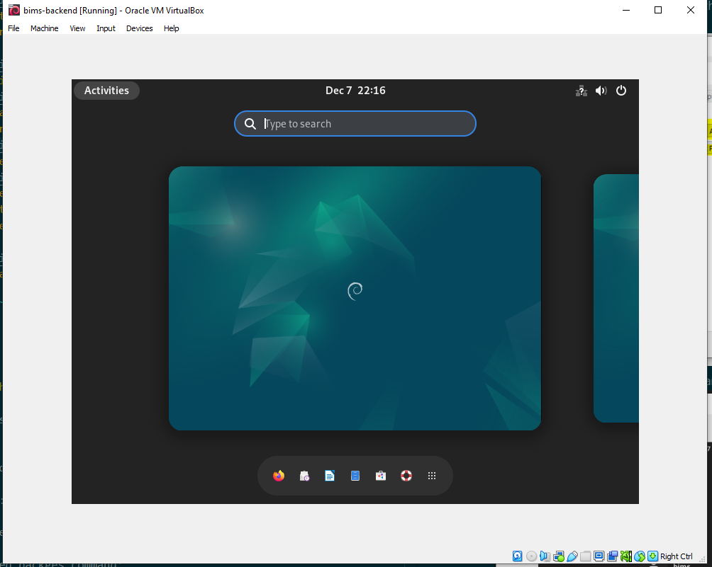
16. now open cmd/terminal and run the command ```ip a``` to view the if the machine got an ip address that is connected to the current network of the host PC. You can see the ip address that this machine got is 192.168.254.176
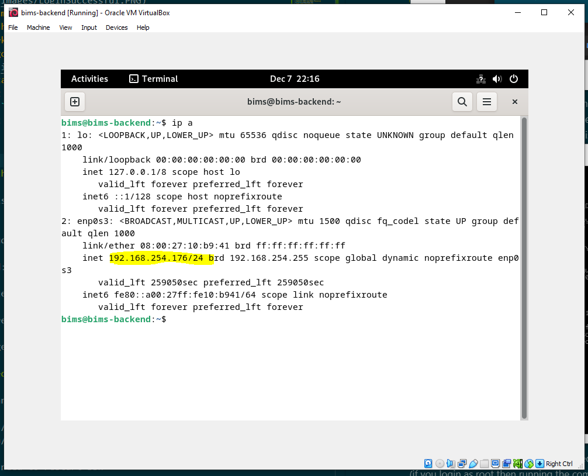
17. Now update and install required packages but change to root user first 
change to root user command:
```
su
```
> then enter the password of the user root    

Update command:
```
sudo apt update
```
Install required packges command:
```
apt install wget git ssh make
```
> then you need to configure the ssh to enable to login using root remotely.
run this command to enable ssh and enable root login remotely
```
sudo sed -i 's/#PermitRootLogin prohibit-password/PermitRootLogin yes/' /etc/ssh/sshd_config
```
then next you need to restart ssh
```
systemctl restart ssh
```
18. Now Open Putty and enter the ip address we got from the command ```ip a``` (192.168.254.176 in our case)
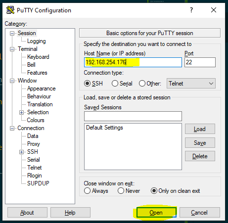
19. click accept
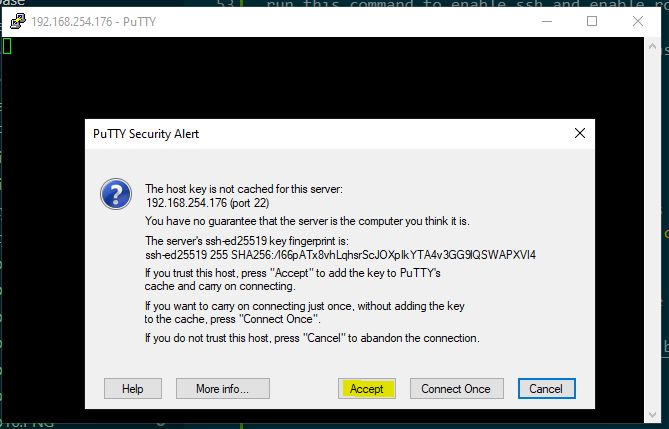
20. Then Login as root then enter the root password (same password as the user we created)
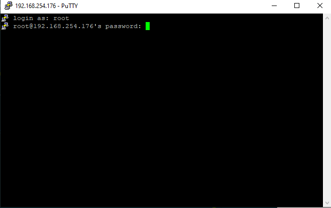
21. Now we are currently logged-in into the debian machine
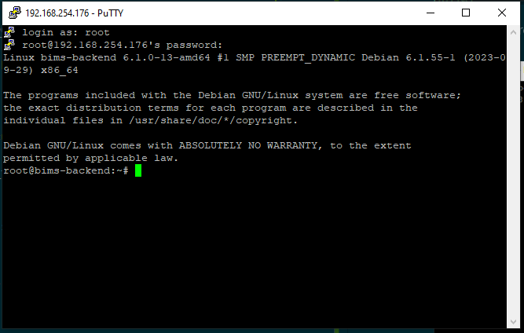
22. go to the /root directory git clone the bims-backend
```
git clone https://github.com/pd1drone/bims-backend
```
23. Go to the directory TGSCA-Backend
```
cd bims-backend/
```
24. Make the shell scripts executable
```
chmod +x shell_scripts/create_bims_service_file.sh
```
```
chmod +x shell_scripts/import.sh
```
```
chmod +x shell_scripts/install.sh
```
```
chmod +x shell_scripts/md5.sh
```
```
chmod +x shell_scripts/update_admin.sh
```
25. run the install.sh script
```
shell_scripts/install.sh
```
then next run this command to be able to run go
```
source /etc/profile.d/go.sh
```
26. run the import.sh script
```
shell_scripts/import.sh
```
>You will be asked to enter the username and passworsd
Username: root
Password: admin123

27. run the make command to tidy the packages and create a golang executable file
```
make build
```
28. run the create_bims_service_file.sh
```
shell_scripts/create_bims_service_file.sh
```

## TO Check if the Backend is now running run the command
```
systemctl status bims_backend
```
>if the status is active and running then the backend is now running successfully
```
root@bims-backend:~/bims-backend# systemctl status bims_backend
● bims_backend.service - bims backend http server
     Loaded: loaded (/etc/systemd/system/bims_backend.service; enabled; preset:>
     Active: active (running) since Thu 2023-12-07 22:30:59 +08; 3s ago
   Main PID: 5854 (bims)
      Tasks: 5 (limit: 4623)
     Memory: 2.7M
        CPU: 8ms
     CGroup: /system.slice/bims_backend.service
             └─5854 /root/bims-backend/cmd/bims
```

## Also access this link to check if you have access to the backend api
```
http://<ipaddress_of_debian_vm>:8085/check
```
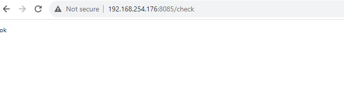
>Now the backend is accessible in the browser

## Now the last step in this is to update the ```components\api_conf.tsx``` file in the https://github.com/biencarlo/bims-frontend
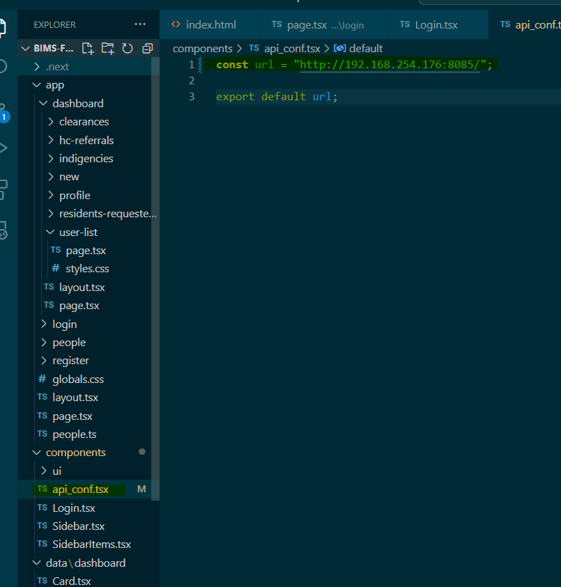